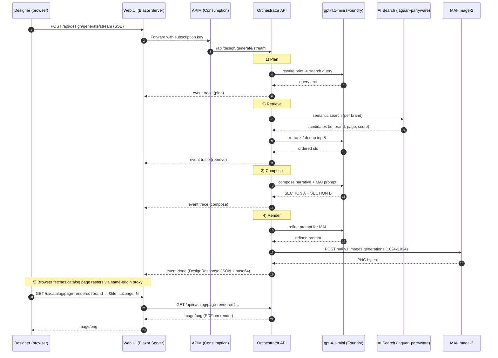

# Interior Design Accelerator — Modern Bathroom

> A reference implementation that pairs **Microsoft Foundry** (gpt-4.1-mini + MAI-Image-2), **Azure AI Search** (per-brand catalog indexes), **Document Intelligence Layout**, **Azure Container Apps**, **Azure App Service (Blazor Server)** and **Azure API Management** into an end-to-end content-generation accelerator for interior designers.

<p align="center">
  <a href="#"></a>
  <a href="#"></a>
  <a href="#"></a>
  <a href="#"></a>
  <a href="#"></a>
  <a href="LICENSE"></a>
  <a href=".github/workflows/ci.yml"></a>
</p>

---

## Use case

> *A senior interior designer is briefing a client on a master ensuite. She types into the Design Studio:*
>
> *"Design a luxury marble ensuite featuring a Jaguar single-lever basin mixer in brushed gold, a Parryware concealed thermostatic shower, and book-matched Calacatta marble walls with warm uplighting."*

In **under 60 seconds** she gets back:

1. **A photoreal 1024x1024 bathroom render** from **MAI-Image-2** that interprets her brief.
2. **A markdown narrative** explaining design choices, naming each catalog product and reflecting the requested style hints.
3. **A "Fittings you may like" gallery** of the *actual* products surfaced by **Foundry IQ** semantic search over the **Jaguar** and **Parryware** catalogs — each card shows the **rendered PDF page** of the cited catalog entry and one-click opens that page.
4. **A live agent-trace panel** (Foundry-Playground-style) that streams every step as Server-Sent Events.

The narrative is **honest about its boundaries**: MAI provides *inspiration*; Foundry IQ provides *shoppable discovery*. The designer can specify the actual SKUs straight from the cards.

---

## Why this exists

| Capability | Implemented by |
|---|---|
| Real product grounding (no hallucinations) | **Azure AI Search** with per-brand semantic indexes, seeded from PDFs via **Document Intelligence Layout** |
| **Foundry IQ Knowledge Base** | `bath-fittings-kb` on the AI Search service combining `jaguar-ks` + `parryware-ks` knowledge sources (auto-provisioned by `deploy.ps1` Phase 8c-pre, visible in Foundry portal -> Build -> Knowledge -> Knowledge bases) |
| Photoreal visual interpretation | **MAI-Image-2** (Microsoft-published Foundry image model) |
| Re-ranking and concise narratives | **gpt-4.1-mini** chat model on Foundry |
| Multi-agent orchestration | **Microsoft Agent Framework** style pipeline (Plan -> Retrieve -> Compose -> Render) |
| Honest UI separation | "MAI for inspiration / Foundry IQ for shoppable discovery" |
| Same-origin browser fetch | Web.Ui proxies catalog page rasters so the browser never has to carry an APIM key |
| Zero secrets | **Managed Identity** end-to-end; no API keys, no SAS |
| One-command deploy | Idempotent fingerprint-driven `deploy.ps1` |

---

## High-level architecture

<p align="center">
  
</p>

<p align="center"><sub>
  Microsoft Foundry (Azure OpenAI · GPT-4.1 Mini · Foundry IQ · Document Intelligence) ·
  MAI-Image Generation · MAF Orchestration Layer (Request Handler · Workflow Orchestrator · Trace Monitor SSE) ·
  Brand Catalogs (Jaguar · Parryware) on Azure Blob Storage · Azure AI Search ·
  Azure API Management · Azure Container Apps · Azure App Service (Blazor Server) · Azure Monitor
  &nbsp;|&nbsp; <a href="docs/assets/architecture.svg">SVG (editable)</a>
</sub></p>

> Source SVG (editable): [`docs/assets/architecture.svg`](docs/assets/architecture.svg) — see [`docs/ARCHITECTURE.md`](docs/ARCHITECTURE.md#regenerating-the-diagram) for notes on regenerating the diagram.

---

## Request flow



For more depth see [`docs/ARCHITECTURE.md`](docs/ARCHITECTURE.md) and [`docs/FLOW.md`](docs/FLOW.md).

---

## How Foundry IQ is used (and where in the code)

Foundry IQ shows up in two distinct places in this build. Both are real, both are loggable.

### 1. Build-time - the Knowledge Base resource

`infra/scripts/deploy.ps1` Phase **8c-pre** issues three `PUT`s against the Azure AI Search service:

| Resource | REST call (api-version=`2025-11-01-preview`) |
|---|---|
| `jaguar-ks` knowledge source | `PUT https://{search}.search.windows.net/knowledgesources/jaguar-ks` (wraps the `jaguar-catalog` index) |
| `parryware-ks` knowledge source | `PUT https://{search}.search.windows.net/knowledgesources/parryware-ks` (wraps the `parryware-catalog` index) |
| `bath-fittings-kb` knowledge base | `PUT https://{search}.search.windows.net/knowledgebases/bath-fittings-kb` (references both knowledge sources above) |

After deploy, the KB is visible in **Foundry portal -> Build -> Knowledge -> Knowledge bases**. The deployer's `Search Service Contributor` role (granted by `infra/modules/search.bicep`) is what allows this control-plane call.

### 2. Run-time - the semantic search call (per user brief)

`src/Orchestrator.Api/Services/CatalogSearchService.cs` line 84:

```csharp
var options = new SearchOptions {
    Size = perIndexTop,
    QueryType = SearchQueryType.Semantic,
    SemanticSearch = new SemanticSearchOptions { SemanticConfigurationName = "default" }
};
var response = await client.SearchAsync<SearchDocument>(query, options, ct);   // <-- the Foundry IQ call
```

This is invoked from `FoundryCatalogSearchAgent.FindAsync` line 78 (`Step A`) - the orchestrator's UAMI hits the AI Search semantic endpoint, fans out across both brand indexes, and returns the top-12 candidates. Then `Step B` hands those 12 to the `catalog-search-agent` for re-ranking.

### What the catalog-search-agent contributes

The Foundry-side `catalog-search-agent` (gpt-4.1-mini) is a **re-ranker over text**, not a retrieval agent:

- **Dedup** of near-duplicate products that AI Search returns from multiple PDF pages
- **Brief-fit judgment** - re-orders by fit to the user's design intent rather than raw vector similarity
- **Brand-balance** - when both Jaguar + Parryware are selected, ensures the gallery represents both

It operates on the JSON candidate list the orchestrator hands it inline, so it doesn't need its own knowledge bindings to do its job. The Foundry IQ KB created in step 1 above is the deployed artifact for the integration story; the runtime path uses the underlying AI Search semantic surface that the KB wraps.

### File:line cheat-sheet

| Concept | File | Line(s) |
|---|---|---|
| KB creation REST | `infra/scripts/deploy.ps1` | Phase 8c-pre block (~2229-2400) |
| Semantic search options | `src/Orchestrator.Api/Services/CatalogSearchService.cs` | 76-81 |
| The actual Foundry IQ call | `src/Orchestrator.Api/Services/CatalogSearchService.cs` | 84 |
| Where the orchestrator invokes it | `src/Orchestrator.Api/Agents/Foundry/FoundryAgents.cs` | 78 (`Step A`) |
| Agent re-rank | `src/Orchestrator.Api/Agents/Foundry/FoundryAgents.cs` | 92 (`Step B`) |
| Index semantic configuration definition | `infra/scripts/deploy.ps1` | Phase 6 (~1762-1770) |

---

## Repository layout

```
InteriorDesignAccelerator.slnx              .NET 8 solution (slnx format)
src/
  Orchestrator.Api/                         ASP.NET 8 Minimal API - multi-agent pipeline
    Agents/                                 IChatAgent, ICatalogSearchAgent, IImageGenAgent + Foundry impls
    Endpoints/                              Design + Catalog page proxy endpoints
    Foundry/                                FoundryResponsesClient (data-plane wrapper)
    Services/                               CatalogSearchService, CatalogPageImageExtractor, GeneratedImageStore
    Options/                                AzureOptions (strongly-typed config)
  Web.Ui/                                   Blazor Server UI + same-origin catalog proxy
    Components/Chat/                        ChatThread, MessageBubble, ProductCard, LiveTracePanel
    Services/DesignApiClient.cs             Typed HttpClient (SSE + raw streams)
  Shared.Contracts/                         DTOs (DesignRequest, CatalogItem, AgentTrace, DesignResponse)
tests/
  Orchestrator.Tests/                       xUnit smoke tests
tools/
  CatalogExtractor/                         Document Intelligence Layout extractor (deploy-time)
  foundry-test/                             Standalone REST harness for probing the Foundry agents
                                            binding API surface (test-create-agent.ps1) - useful when
                                            Microsoft updates the preview shape and we want to retry
                                            attaching the KB without running the full deploy
agents/                                     Foundry hosted-agent JSON definitions
infra/
  modules/                                  One Bicep module per Azure resource
  scripts/deploy.ps1                        Idempotent fingerprint-driven deployer
docs/
  ARCHITECTURE.md                           Deep architecture + design decisions
  DEPLOYMENT.md                             Step-by-step Azure deployment guide
  FLOW.md                                   Request flow + sequence diagrams
  USE_CASE.md                               The bathroom-designer scenario in full
.github/
  workflows/ci.yml                          GitHub Actions: build + test on push/PR
  ISSUE_TEMPLATE/                           Bug + feature + question templates
  PULL_REQUEST_TEMPLATE.md
```

---

## Quick start

### Prerequisites

| Tool | Version | Notes |
|---|---|---|
| **.NET SDK** | 8.0+ | `dotnet --version` |
| **Azure CLI** | 2.61+ | `az --version` |
| **PowerShell** | 7.4+ (`pwsh`) | Cross-platform |
| **Azure subscription** | with Foundry-region quota | `swedencentral` recommended |
| **Catalog PDFs** | Jaguar + Parryware | See [Data & licensing](#data--licensing) |

### Build & test locally

```pwsh
dotnet build .\InteriorDesignAccelerator.slnx
dotnet test  .\tests\Orchestrator.Tests\Orchestrator.Tests.csproj
```

### Run locally

```pwsh
# Terminal 1 - orchestrator API
dotnet run --project .\src\Orchestrator.Api\Orchestrator.Api.csproj

# Terminal 2 - Blazor UI
dotnet run --project .\src\Web.Ui\Web.Ui.csproj
```

Open the URL printed by Web.Ui. Make sure `Orchestrator:BaseUrl` in `src/Web.Ui/appsettings.Development.json` (or `appsettings.json`) matches the orchestrator's listening port.

### Deploy everything to Azure

```pwsh
pwsh .\infra\scripts\deploy.ps1
```

The script is **idempotent** and **fingerprint-driven** - re-running it only redeploys what actually changed (Bicep modules, container images, AI Search index, Web.Ui). Full walkthrough: **[`docs/DEPLOYMENT.md`](docs/DEPLOYMENT.md)**.

---

## Security baseline

What's **enabled** out of the box:

- **No keys / no SAS** anywhere - every service-to-service call uses **Managed Identity**.
- **APIM subscription key** gates the orchestrator from the public internet.
- **TLS 1.2+**, **HTTPS-only** on App Service.
- **AAD-only AI Search** (`aadAuthFailureMode = http401WithBearerChallenge`).
- **`allowBlobPublicAccess = false`** on the catalog blob container.
- **Per-page PDF proxy** so the browser never sees a direct blob URL.

What's **deliberately not** enabled (and is the next hardening pass):

- Private endpoints on Storage / Search / Foundry / Key Vault
- VNet integration on App Service / Container Apps
- APIM internal-mode (StV2)
- Customer-managed keys for storage encryption

See [`SECURITY.md`](SECURITY.md) for the disclosure policy and the hardening checklist in [`docs/DEPLOYMENT.md`](docs/DEPLOYMENT.md).

---

## Cost-conscious defaults

| Service | SKU | Why |
|---|---|---|
| Azure AI Search | `basic` | Smallest SKU with semantic search |
| Storage | `Standard_LRS` | Demo-only |
| App Service | `B1 Linux` | Cheap, AlwaysOn-capable |
| Container Apps | `Consumption` | Scale-to-zero |
| APIM | `Consumption` | Pay-per-call |
| Log Analytics | `PerGB2018`, 30-day retention | |
| Foundry models | `gpt-4.1-mini` (50 TPM) + `MAI-Image-2` (1 RPM) | Minimum viable demo quota |

Total idle cost is typically **<US$5/day** in `swedencentral`. The bulk of variable cost is MAI per-image generation.

---

## What you'll see in the live trace

The orchestrator emits one SSE `event: trace` per step. A typical successful turn:

```
STARTED         orchestrator       brief='Design a luxury marble ensuite...', brands=[Jaguar,Parryware]
PLAN-BEGIN      chat               rewriting brief into search query...
PLAN            chat               luxury marble ensuite Jaguar brushed gold single-lever basin mixer ...
RETRIEVE-BEGIN  catalog-search     querying brand catalog indexes...
RETRIEVE        catalog-search     8 products: parryware/Parryware Catalogue (1) - page 5; jaguar/Jaguar Laguna Collection (p.1); ...
COMPOSE-BEGIN   chat               writing narrative + image prompt...
COMPOSE         chat               Eye-level wide shot of a modern minimalist luxury ensuite bathroom...
RENDER-BEGIN    image-gen          calling MAI image model (this can take 20-40s)...
RENDER          image-gen          1010 KB image
DONE            orchestrator       58777 ms
```

---

## Contributing

Contributions are welcome - bugs, features, docs, tests. Read **[`CONTRIBUTING.md`](CONTRIBUTING.md)** for ground rules and **[`CODE_OF_CONDUCT.md`](CODE_OF_CONDUCT.md)** for the community standards we enforce.

For questions, see **[`SUPPORT.md`](SUPPORT.md)**.

---

## Data & licensing

This repository's **code** is licensed under the **MIT License** - see [`LICENSE`](LICENSE).

Catalog PDFs/images of **Jaguar** and **Parryware** products are **third-party copyrighted material**. They are referenced for the demo only and are **not** redistributed in this repository. Place them under `data/catalogs/jaguar/` and `data/catalogs/parryware/` in the repo (these folders are git-ignored except for `.gitkeep`); `deploy.ps1` Phase 5 then differentially syncs them to Azure Blob Storage. If you have a folder elsewhere, pass it once with `-CatalogSourcePath '<path>'` and the script will stage it into `data/catalogs/` for you. You are responsible for your right to use these materials.

The names *Jaguar* and *Parryware* are trademarks of their respective owners and are used here strictly to illustrate a brand-grounded retrieval pattern.

The architecture diagrams in [`docs/assets/`](docs/assets/) embed service icons from the **Microsoft Azure Architecture Icons** set (© Microsoft Corporation). They are used here in line with Microsoft's [icon terms of use](https://learn.microsoft.com/azure/architecture/icons/) — see [`docs/assets/azure-icons/ATTRIBUTION.md`](docs/assets/azure-icons/ATTRIBUTION.md) for details.

---

## Acknowledgements

- **Microsoft Foundry** team for the Agents + MAI image surface
- **Azure AI Search** team for the semantic ranker
- **PDFium / PDFtoImage / PdfPig** for the PDF tooling that makes the per-page renderer possible
- **Blazor** + **Minimal APIs** for an extremely productive .NET 8 dev loop

---

<p align="center"><sub>Built to show how text-to-image and grounded retrieval play <em>complementary</em> roles in production AI.</sub></p>
