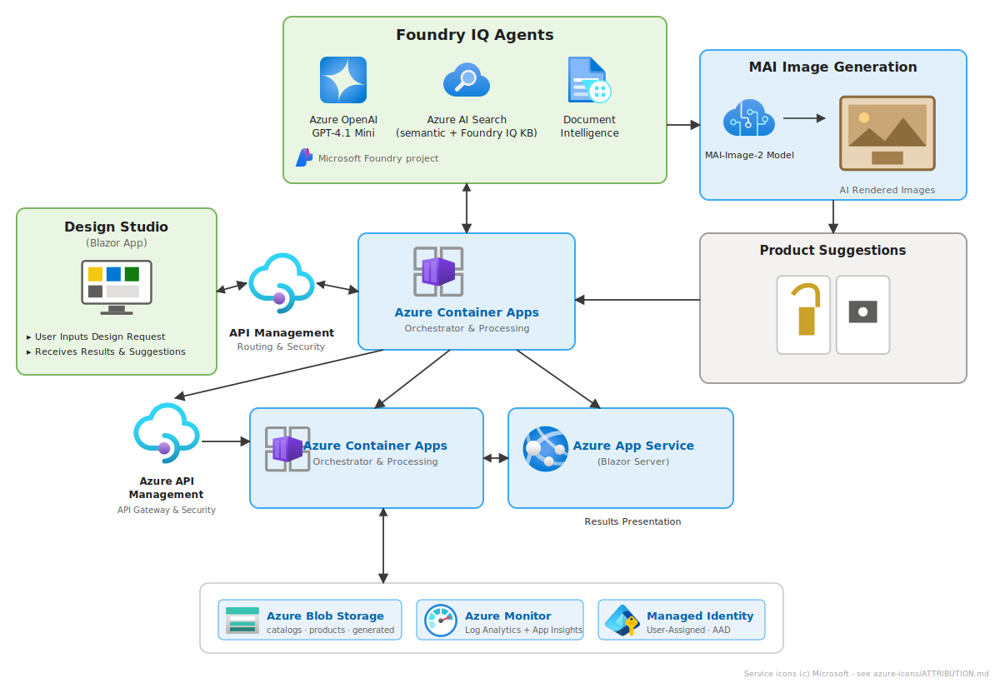
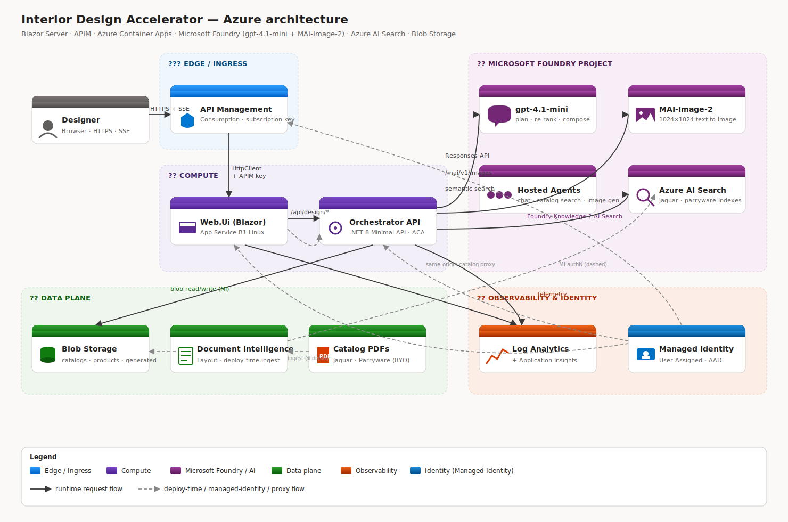

# Architecture

This document describes the runtime, data and security architecture of the **Interior Design Accelerator** and the design decisions behind it. It is intended for engineers who want to extend the accelerator or adapt it to a different vertical.

For the request-time control flow, see [`FLOW.md`](FLOW.md). For the product scenario, see [`USE_CASE.md`](USE_CASE.md). For deployment mechanics, see [`DEPLOYMENT.md`](DEPLOYMENT.md) and [`DEPLOY_SCRIPT.md`](DEPLOY_SCRIPT.md).

---

## 1. Goals & non-goals

### Goals

- Show how **text-to-image generation** and **grounded retrieval** play *complementary* roles in production AI.
- Use **Microsoft Foundry** as the single AI control plane (chat + image + hosted agents + Knowledge).
- Stay **secret-less** end-to-end — every service-to-service call uses **Managed Identity**.
- Be **idempotent and resumable** — `deploy.ps1` re-runs only what changed.
- Stay **cheap to run** — defaults pick the smallest viable SKUs; total idle cost <US$5/day.

### Non-goals

- This is **not** a production-hardened, multi-tenant SaaS. There are no private endpoints, no VNets, no WAF, no CMK. See the *Hardening checklist* in `DEPLOYMENT.md`.
- It is **not** a generic RAG framework — the retrieval pipeline is deliberately specialised to a per-brand catalog model.
- It does **not** redistribute third-party catalog PDFs. You bring your own.

---

## 2. Components

<p align="center">
  
</p>

<p align="center"><sub>
  PNG: <a href="assets/architecture-overview.png">assets/architecture-overview.png</a> ·
  Source SVG: <a href="assets/architecture-overview.svg">assets/architecture-overview.svg</a>
</sub></p>

<details>
<summary>Detailed tiered view (click to expand)</summary>

<p align="center">
  
</p>

> PNG export: [`assets/architecture.png`](assets/architecture.png) · Source SVG: [`assets/architecture.svg`](assets/architecture.svg).

</details>

### Regenerating the diagram

The diagram is a hand-authored SVG (`docs/assets/architecture.svg`) — edit it in any SVG editor (VS Code with an SVG preview extension, Inkscape, Figma, etc.) and re-export the PNG with:

```pwsh
# one-time: install sharp in a scratch folder
$tmp = Join-Path $env:TEMP 'svg2png'
New-Item -ItemType Directory -Force -Path $tmp | Out-Null
Push-Location $tmp
npm init -y | Out-Null
npm install --no-audit --no-fund sharp
Pop-Location

# render PNG from SVG (run from repo root)
@"
const sharp = require('sharp');
const fs = require('fs');
sharp(fs.readFileSync('docs/assets/architecture.svg'), { density: 200 })
  .resize(1480, 980).png({ compressionLevel: 9 })
  .toFile('docs/assets/architecture.png')
  .then(i => console.log('ok', i.width + 'x' + i.height, i.size, 'bytes'));
"@ | Out-File -Encoding utf8 "$tmp\conv.js"
node "$tmp\conv.js"
```

| # | Component | Role |
|---|---|---|
| 1 | **Browser** | Plain HTML/CSS via Blazor Server's SignalR circuit. Streams agent traces over SSE; fetches catalog page rasters from the same origin. |
| 2 | **Web.Ui** (`src/Web.Ui`) | Blazor Server on App Service (Linux B1). Hosts the chat UI, proxies SSE and catalog-page bytes from the orchestrator (so the APIM subscription key never reaches the browser). |
| 3 | **APIM** (Consumption SKU) | Public ingress for the orchestrator. Subscription-key-gated. Single `/design/*` operation set. |
| 4 | **Orchestrator API** (`src/Orchestrator.Api`) | ASP.NET 8 Minimal API in a single container on Azure Container Apps. Runs the multi-agent pipeline. |
| 5 | **Microsoft Foundry project** | Houses the two model deployments (`gpt-4.1-mini`, `MAI-Image-2`) and three hosted agents (`chat-agent`, `catalog-search-agent`, `image-gen-agent`). |
| 6 | **Azure AI Search** | Per-brand semantic index (`jaguar-catalog`, `parryware-catalog`). AAD-only (`http401WithBearerChallenge`). |
| 7 | **Storage** | Blob containers `catalogs` (source PDFs + images), `products` (extracted JSON), `generated` (saved renders). `allowBlobPublicAccess = false`. |
| 8 | **Log Analytics + App Insights** | Centralised logs/metrics for every component. |
| 9 | **User-Assigned Managed Identity** | Single MI is the principal for ACA, App Service and APIM. RBAC is granted only once per resource. |

---

## 3. Solution layout

```
InteriorDesignAccelerator.slnx
src/
  Orchestrator.Api/
    Agents/
      ITaskAgent.cs              base abstraction (Run(input, ctx, ct))
      OrchestratorAgent.cs       the Plan -> Retrieve -> Compose -> Render pipeline
      Foundry/FoundryAgents.cs   IChatAgent, ICatalogSearchAgent, IImageGenAgent + Foundry impls
    Endpoints/
      DesignEndpoints.cs         /api/design/generate, /api/design/generate/stream
      CatalogPageEndpoint.cs     /api/catalog/page-rendered (PDFium per-page raster)
    Foundry/
      FoundryResponsesClient.cs  data-plane wrapper around services.ai.azure.com
    Services/
      CatalogSearchService.cs    AAD-auth REST calls to Azure AI Search
      CatalogPageImageExtractor  on-demand per-page PNG render from the source PDF
      GeneratedImageStore.cs     persists MAI outputs to the 'generated' container
    Options/AzureOptions.cs      typed Azure:* config block
    Program.cs                   DI + endpoint mapping
    Dockerfile                   multi-stage (sdk -> aspnet-runtime)
  Web.Ui/
    Components/Chat/             Razor components: ChatThread, MessageBubble,
                                 ProductCard, LiveTracePanel, ComposerInput, ...
    Components/Pages/Home.razor  the only page
    Services/DesignApiClient.cs  typed HttpClient -> APIM with subscription key
    Program.cs                   AddHttpClient, AddRazorComponents, etc.
  Shared.Contracts/
    DesignRequest / DesignResponse / CatalogItem / AgentTrace DTOs
tests/Orchestrator.Tests/         xUnit smoke + unit tests
tools/CatalogExtractor/           Document Intelligence Layout extractor (deploy-time)
agents/                           Foundry hosted-agent JSON definitions
infra/
  modules/*.bicep                 one Bicep module per resource
  scripts/deploy.ps1              the fingerprint-driven, idempotent deployer
  scripts/cleanup.ps1             tear-down helper
data/catalogs/                    local mirror of catalog PDFs (gitignored)
docs/                             the document you're reading
```

---

## 4. The multi-agent pipeline

`OrchestratorAgent` is a deliberately simple, **explicit** orchestration of four steps. Each step is a `ITaskAgent`-style call to one of three injected agents:

| Agent | Backed by | Responsibility |
|---|---|---|
| `IChatAgent` | `chat-agent` (hosted) / `FoundryResponsesClient` direct calls to `gpt-4.1-mini` | Brief rewriting, re-ranking, narrative composition, MAI prompt refinement |
| `ICatalogSearchAgent` | `catalog-search-agent` + `CatalogSearchService` | Per-brand semantic search against `<brand>-catalog` indexes |
| `IImageGenAgent` | `image-gen-agent` + `MAI-Image-2` deployment | 1024×1024 PNG generation |

Pipeline:

1. **Plan** — `IChatAgent` rewrites the natural-language brief into a clean search query (dedup adjectives, drop filler, expand brand synonyms).
2. **Retrieve** — `ICatalogSearchAgent` runs the planned query against each selected brand index in parallel, then `IChatAgent` re-ranks the merged candidate list and drops any hallucinated ids.
3. **Compose** — `IChatAgent` writes the markdown narrative (SECTION A) and a description for MAI (SECTION B), citing each retrieved product by name.
4. **Render** — `IChatAgent` refines SECTION B into a high-fidelity image prompt; `IImageGenAgent` calls MAI; the bytes are saved to the `generated` container and base64-embedded in the SSE response.

Each step emits a structured `AgentTrace` event over SSE before and after execution. The browser renders them live in the **Agent trace** panel.

### Why an explicit pipeline?

- **Determinism / debuggability.** Each step has a single responsibility and a single trace line. We can replay any step in isolation.
- **Cost control.** We only call MAI once per turn, and we only call the chat model for steps that genuinely need an LLM.
- **Boundary honesty.** The UI separates "MAI inspiration" (the render) from "Foundry IQ discovery" (the catalog cards) because they come from architecturally different components. A monolithic agent would blur that distinction.

---

## 5. Data flow

### 5.1 Build time (in `deploy.ps1`)

```
PDF (Jaguar / Parryware)   ---rclone---> Blob: catalogs/<brand>/...
                                          |
                                          v
                            Document Intelligence Layout (Phase 8d)
                                          |
                                          v  one JSON row per PDF page
                            Blob: products/<brand>.json
                                          |
                                          v
                            AI Search indexer (jsonArray, Phase 8e)
                                          |
                                          v
                            Index: <brand>-catalog (semantic-enabled)
```

### 5.2 Runtime

See [`FLOW.md`](FLOW.md) for the per-request sequence diagram.

### 5.3 Image hand-off

| What | Where | Why |
|---|---|---|
| **Catalog page rasters** | rendered on-demand by `CatalogPageImageExtractor` from the source PDF in blob, served via `/api/catalog/page-rendered`, proxied by Web.Ui at `/ui/catalog/page-rendered`. | We never expose a direct blob URL or a SAS; the browser stays on the Web.Ui origin and Web.Ui carries the APIM key server-side. |
| **MAI renders** | base64-embedded in the `done` SSE event AND persisted to `generated/`. | Embedding makes the UI work without a second round-trip; persisting lets us reference them from history later. |

---

## 6. Security

### What's enabled

- **No keys, no SAS** anywhere in the runtime path. Every Azure call uses Managed Identity via `DefaultAzureCredential`/`ManagedIdentityCredential`.
- **APIM subscription key** gates the orchestrator. The key lives in Web.Ui's app settings (set via `az webapp config appsettings set`), never in the browser.
- **AAD-only AI Search** (`aadAuthFailureMode = http401WithBearerChallenge`).
- **`allowBlobPublicAccess = false`** on the catalog storage account; all reads go through the orchestrator's MI.
- **TLS 1.2+ / HTTPS-only** on App Service.
- **Per-page PDF proxy** so the browser never sees a direct blob URL.

### What's deliberately NOT enabled (the next hardening pass)

- Private endpoints on Storage / Search / Foundry / Key Vault
- VNet integration on App Service / Container Apps
- APIM `Developer` or `Premium` in internal mode
- Customer-managed keys for storage encryption
- WAF + Front Door in front of App Service

See the *Hardening checklist* in [`DEPLOYMENT.md`](DEPLOYMENT.md) for the full list.

---

## 7. Cost shape

| Service | SKU | Idle/day |
|---|---|---|
| AI Search | `basic` (semantic) | ~$2.50 |
| Storage | `Standard_LRS` | <$0.10 |
| App Service | `B1 Linux` | ~$0.40 |
| Container Apps | Consumption (scale-to-zero) | ~$0 idle |
| APIM | Consumption | $0 idle, $0.0035 / 10k calls |
| Log Analytics | `PerGB2018`, 30-day retention | <$0.10 |
| Foundry models | gpt-4.1-mini 50 TPM, MAI-Image-2 1 RPM | $0 idle |

Variable cost is dominated by MAI per-image generation. The chat model is small enough that per-turn cost is dominated by image generation.

---

## 8. Key design decisions

| Decision | Why |
|---|---|
| **Per-brand AI Search indexes** instead of one unified index with a `brand` filter | Lets each brand have a different schema, a different semantic config, and a different indexer cadence. Avoids cross-brand reranker bias. |
| **Document Intelligence Layout** over a custom PDF parser | Handles tables, columns, headers, footnotes deterministically. Output is stable across re-runs. |
| **One Bicep module per resource**, one phase per module | `deploy.ps1` can resume from the failed phase. Fingerprinting is per-module. |
| **Fingerprint-driven phases** in `deploy.ps1` | Re-runs are fast (~10 min). Only changed Bicep modules / changed catalog files / changed image source code redeploy. |
| **Blazor Server** (not WASM) for the UI | SSE consumption is trivial server-side; we keep the APIM subscription key server-side; first paint is sub-second. |
| **Same-origin catalog proxy** in Web.Ui | The browser would otherwise need the APIM key to fetch catalog pages directly. We refuse. |
| **`DefaultAzureCredential`** in code | Works locally (`az login`/VS sign-in) and in Azure (User-Assigned MI) without code changes. |
| **APIM Consumption** | Free idle + per-call billing; sufficient as a demo gateway. Internal-mode `Developer`/`Premium` is the production upgrade. |
| **`global.json` with `rollForward: latestMajor`** | Lets the same repo build on .NET 8 and .NET 9 SDKs. |

---

## 9. Extending the accelerator

| Want to... | Touch... |
|---|---|
| Add a new brand | Drop the PDFs in `C:\Bath Fittings Data\<brand>\` and re-run `deploy.ps1`. The script auto-discovers the folder. |
| Add a new agent step | Implement an `ITaskAgent`, register it in `Program.cs`, call it from `OrchestratorAgent`. Emit a trace before/after. |
| Swap the chat model | Change `-ChatModelName` and `-ChatModelVersion` on `deploy.ps1`. |
| Move to a private network | Add `infra/modules/network.bicep`, add private endpoints to each module, wire VNet integration on App Service + ACA. |
| Pin the orchestrator image | Add a CI step that pushes to your ACR, then `az containerapp update --image <fqdn>@<digest>`. |
