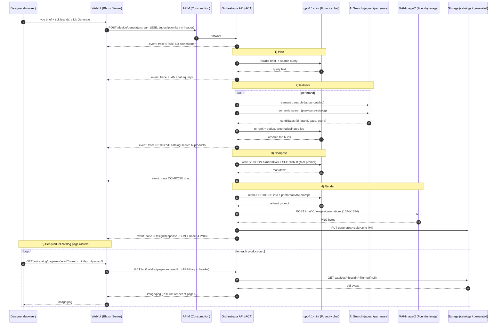

# Request flow

This document traces a single design-generation turn end-to-end, from the user's keystroke to the rendered image. See [`ARCHITECTURE.md`](ARCHITECTURE.md) for the static view.

---

## 1. End-to-end sequence



---

## 2. SSE event schema

The orchestrator streams two event types:

### `event: trace`

```json
{
  "ts": "2025-11-04T19:22:08.144Z",
  "phase": "RETRIEVE-BEGIN | RETRIEVE | COMPOSE-BEGIN | COMPOSE | RENDER-BEGIN | RENDER | STARTED | DONE | ERROR",
  "agent": "orchestrator | chat | catalog-search | image-gen",
  "message": "luxury marble ensuite Jaguar brushed gold ...",
  "elapsedMs": 1234
}
```

### `event: done`

A single `DesignResponse` payload (see `Shared.Contracts/DesignResponse.cs`):

```json
{
  "narrative": "## Design notes\n...",
  "imagePngBase64": "iVBORw0K...",
  "products": [
    {
      "id": "jaguar-laguna-1",
      "brand": "jaguar",
      "name": "Jaguar Laguna single-lever basin mixer",
      "pdfFile": "jaguar-catalogue.pdf",
      "pageNumber": 12,
      "score": 0.82
    }
  ],
  "elapsedMs": 58777
}
```

### `event: error`

```json
{ "agent": "image-gen", "message": "MAI 429 throttled, retrying in 4s" }
```

---

## 3. Catalog page proxy

The browser never talks to APIM directly for page rasters. Instead:

1. `ProductCard.razor` renders ``.
2. `Web.Ui` receives the request on its own origin (no CORS), forwards it to the orchestrator with the APIM subscription key attached server-side, and streams the resulting PNG straight back.
3. The orchestrator (`CatalogPageEndpoint`) pulls the source PDF from blob via MI, lets `CatalogPageImageExtractor` render the requested page with PDFium, and returns `image/png`.

This gives the browser a same-origin URL, keeps the APIM key off the client, and avoids any blob-level SAS.

---

## 4. Failure modes & retries

| Failure | Where caught | Behaviour |
|---|---|---|
| Foundry chat 429 | `FoundryResponsesClient` | exponential back-off, up to 3 retries, then emits `trace ERROR` and continues with a degraded path |
| MAI 429 / 5xx | `IImageGenAgent` | one retry with 4s back-off; on second failure emits `error` and finishes with narrative + product cards only (no image) |
| AI Search 5xx | `CatalogSearchService` | one retry; on second failure the brand is skipped and a `trace` event flags it |
| Blob 404 (catalog page) | `CatalogPageEndpoint` | 404 to the browser; product card renders a fallback placeholder |
| APIM 401 | Web.Ui | bubbled to UI as a banner; deploy.ps1 logs the right key location |

---

## 5. Cancellation

Every step accepts a `CancellationToken` derived from the HTTP request. If the browser disconnects mid-stream:

- The SSE connection is torn down; ASP.NET cancels the token.
- In-flight Foundry calls are cancelled at the next yield.
- The MAI call uses the same token and is cancellable as long as the HTTP stream hasn't entered the final read.
